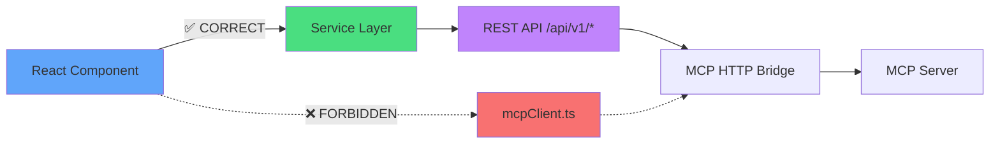
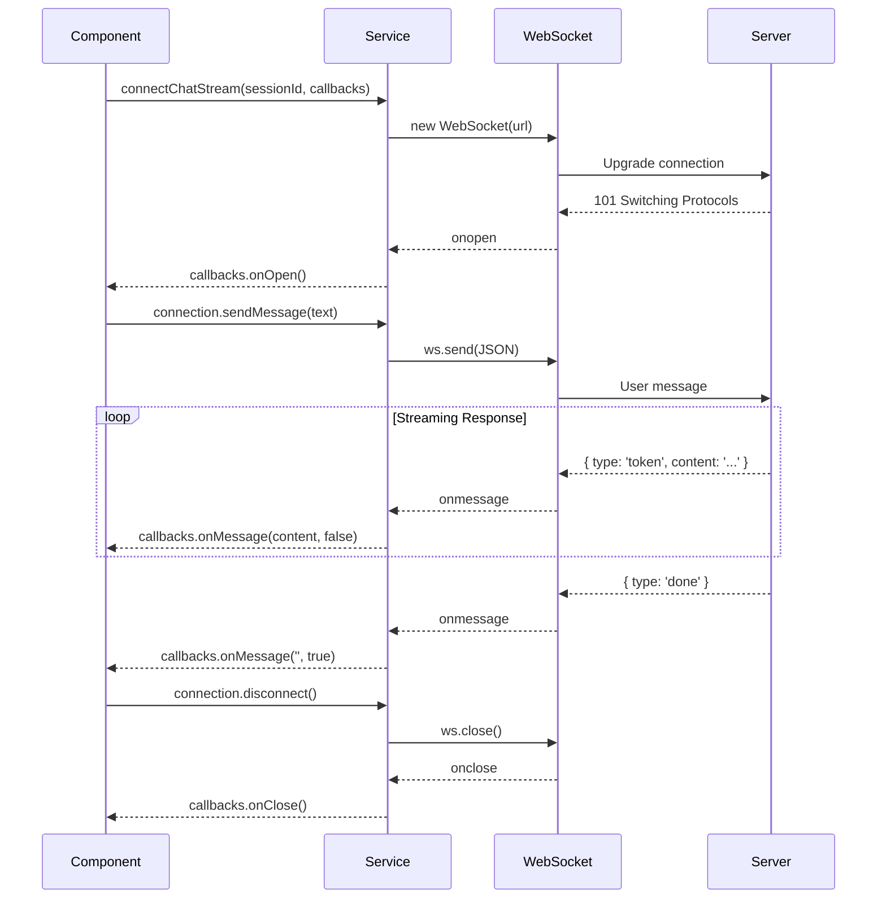

# Hyperion Coordinator UI - API Integration Guide

## Table of Contents

1. [Overview](#overview)
2. [Architecture Rules](#architecture-rules)
3. [Service Layer](#service-layer)
4. [REST API Integration](#rest-api-integration)
5. [WebSocket Integration](#websocket-integration)
6. [API Client Patterns](#api-client-patterns)
7. [Error Handling](#error-handling)
8. [Type Safety](#type-safety)
9. [Testing API Integration](#testing-api-integration)

---

## Overview

The Hyperion Coordinator UI follows a **strict layered architecture** where all API communication flows through a dedicated service layer. This document describes how to integrate with the backend APIs correctly.

### API Endpoints

| Base Path | Purpose | Transport |
|-----------|---------|-----------|
| `/api/v1/tasks` | Task management | REST |
| `/api/v1/agent-tasks` | Agent tasks | REST |
| `/api/v1/knowledge` | Knowledge base | REST |
| `/api/v1/chat` | Chat sessions | REST + WebSocket |
| `/api/v1/code` | Code search | REST |
| `/api/mcp` | MCP operations | REST |

---

## Architecture Rules

### ⚠️ CRITICAL: NO DIRECT MCP CALLS

The UI **NEVER** makes direct MCP calls. This rule is enforced by ESLint.



### ESLint Enforcement

**Rule**: `no-restricted-imports` for `mcpClient.ts`

**Error Message**:
```
'../../services/mcpClient' import is restricted from being used.
Direct MCP calls are prohibited. Use ../../services/restClient instead
for task and knowledge operations. Only codeClient.ts should use MCP
tools for code indexing.
```

**Correct Pattern**:
```typescript
// ✅ CORRECT - Use REST client
import { restClient } from '@/services/restClient';

const tasks = await restClient.listHumanTasks();
```

**Incorrect Pattern**:
```typescript
// ❌ WRONG - Direct MCP import
import { mcpClient } from '@/services/mcpClient';

const tasks = await mcpClient.listHumanTasks(); // ESLint error!
```

---

## Service Layer

### Service Modules

The service layer consists of these modules:

| Service | File | Purpose |
|---------|------|---------|
| **REST Client** | `restClient.ts` | Tasks, agent tasks, knowledge, prompt notes |
| **Chat Service** | `chatService.ts` | Chat sessions, WebSocket streaming |
| **Knowledge Service** | `knowledgeService.ts` | Knowledge base operations |
| **Knowledge API** | `knowledgeApi.ts` | Low-level knowledge API |
| **Code Client** | `restCodeClient.ts` | Code search and indexing |
| **MCP Server Service** | `mcpServerService.ts` | MCP server registry |
| **HTTP Tools Service** | `httpToolsService.ts` | HTTP tool operations |
| **AI Service** | `aiService.ts` | AI configuration |
| **Subchat Service** | `subchatService.ts` | Subchat management |

### Service Location

All services are in `src/services/`:

```
src/services/
├── restClient.ts          # Main REST API client
├── chatService.ts         # Chat + WebSocket
├── knowledgeService.ts    # Knowledge operations
├── restCodeClient.ts      # Code search
├── mcpServerService.ts    # MCP registry
├── httpToolsService.ts    # HTTP tools
└── aiService.ts           # AI config
```

---

## REST API Integration

### REST Client (`restClient.ts`)

The primary API client for task management, knowledge operations, and prompt notes.

#### Initialization

```typescript
import { restClient } from '@/services/restClient';

// Client is a singleton - no initialization needed
const tasks = await restClient.listHumanTasks();
```

#### Base URL Configuration

```typescript
const BASE_URL = '/api/v1';

// Requests go through Vite proxy in development
// In production, served by nginx at /api/v1
```

### API Methods

#### Human Tasks

```typescript
// List all human tasks
const tasks: HumanTask[] = await restClient.listHumanTasks();

// Get a single task
const task: HumanTask = await restClient.getHumanTask(taskId);

// Create a new task
const result = await restClient.createHumanTask(
  'Task description here'
);
console.log(result.taskId); // New task ID

// Update task status
await restClient.updateTaskStatus(
  taskId,
  'completed',
  'Optional notes'
);
```

**Response Types**:
```typescript
interface HumanTask {
  id: string;
  prompt: string;
  status: 'pending' | 'in_progress' | 'completed' | 'blocked';
  createdAt: string;
  updatedAt: string;
  notes?: string;
  // UI-added fields
  title: string;
  description: string;
  priority: 'low' | 'medium' | 'high' | 'urgent';
  createdBy: string;
  tags: string[];
}
```

#### Agent Tasks

```typescript
// List all agent tasks (optional filter by agent name)
const agentTasks: AgentTask[] = await restClient.listAgentTasks();
const specificAgentTasks: AgentTask[] = await restClient.listAgentTasks('go-dev');

// Create agent task
const result = await restClient.createAgentTask({
  humanTaskId: 'task-123',
  agentName: 'go-dev',
  role: 'Implement user authentication',
  todos: [
    {
      description: 'Create user model',
      filePath: 'models/user.go',
      contextHint: 'Use bcrypt for password hashing'
    },
    {
      description: 'Create login endpoint',
      filePath: 'handlers/auth.go'
    }
  ],
  contextSummary: 'Implement JWT-based authentication...',
  filesModified: ['models/user.go', 'handlers/auth.go'],
  qdrantCollections: ['project-docs', 'auth-examples']
});

// Update TODO status
await restClient.updateTodoStatus(
  agentTaskId,
  todoId,
  'completed',
  'Implementation completed with tests'
);
```

**Response Types**:
```typescript
interface AgentTask {
  id: string;
  humanTaskId: string;
  agentName: string;
  role: string;
  status: 'pending' | 'in_progress' | 'completed' | 'blocked';
  todos: TodoItem[];
  createdAt: string;
  updatedAt: string;
  notes?: string;
  contextSummary?: string;
  filesModified?: string[];
  priorWorkSummary?: string;
  qdrantCollections?: string[];
  humanPromptNotes?: string;
  humanPromptNotesAddedAt?: string;
  humanPromptNotesUpdatedAt?: string;
}

interface TodoItem {
  id: string;
  description: string;
  status: 'pending' | 'in_progress' | 'completed';
  createdAt: string;
  completedAt?: string;
  notes?: string;
  filePath?: string;
  functionName?: string;
  contextHint?: string;
  humanPromptNotes?: string;
  humanPromptNotesAddedAt?: string;
  humanPromptNotesUpdatedAt?: string;
}
```

#### Prompt Notes (Task Level)

```typescript
// Add task-level prompt notes
await restClient.addTaskPromptNotes(
  agentTaskId,
  'Use TDD approach. Write tests first.'
);

// Update prompt notes
await restClient.updateTaskPromptNotes(
  agentTaskId,
  'Updated guidance: Focus on edge cases'
);

// Clear prompt notes
await restClient.clearTaskPromptNotes(agentTaskId);
```

#### Prompt Notes (TODO Level)

```typescript
// Add TODO-level prompt notes
await restClient.addTodoPromptNotes(
  agentTaskId,
  todoId,
  'Check for SQL injection vulnerabilities'
);

// Update TODO prompt notes
await restClient.updateTodoPromptNotes(
  agentTaskId,
  todoId,
  'Use parameterized queries'
);

// Clear TODO prompt notes
await restClient.clearTodoPromptNotes(agentTaskId, todoId);
```

#### Knowledge Operations

```typescript
// Query knowledge base
const entries: KnowledgeEntry[] = await restClient.queryKnowledge(
  'hyperion-docs',    // collection
  'authentication',   // query
  10                 // limit (optional)
);

// Upsert knowledge entry
const result = await restClient.upsertKnowledge(
  'hyperion-docs',                    // collection
  'JWT authentication implementation', // information
  { category: 'auth', tags: ['jwt', 'security'] } // metadata (optional)
);

// Get popular collections
const collections = await restClient.getPopularCollections(20);
// Returns: [{ collection: 'hyperion-docs', count: 150 }, ...]

// Get all collections
const allCollections = await restClient.getAllCollections();
// Returns: [{ name: 'hyperion-docs', category: 'docs', count: 150 }, ...]

// Browse knowledge (without search)
const entries: KnowledgeEntry[] = await restClient.browseKnowledge(
  'hyperion-docs',  // collection (optional)
  50               // limit (optional)
);
```

**Response Types**:
```typescript
interface KnowledgeEntry {
  id: string;
  collection: string;
  text: string;
  metadata?: Record<string, any>;
  score?: number;
  createdAt: string;
}

interface CollectionInfo {
  collection: string;
  count: number;
}

interface AllCollectionInfo {
  name: string;
  category: string;
  count: number;
}
```

---

### Chat Service (`chatService.ts`)

Provides both REST API and WebSocket interfaces for chat.

#### REST API - Sessions

```typescript
import {
  createSession,
  getSessions,
  getMessages,
  deleteSession,
  updateSession
} from '@/services/chatService';

// Create new chat session
const session: ChatSession = await createSession('My Chat Title');

// Get all sessions
const sessions: ChatSession[] = await getSessions();

// Get messages for a session
const messages: ChatMessage[] = await getMessages(
  sessionId,
  50,  // limit
  0    // offset
);

// Delete session
await deleteSession(sessionId);

// Update session title
const updatedSession: ChatSession = await updateSession(
  sessionId,
  'New Title'
);
```

**Response Types**:
```typescript
interface ChatSession {
  id: string;
  userId: string;
  companyId: string;
  title: string;
  parentChatId?: string;
  createdAt: string;
  updatedAt: string;
}

interface ChatMessage {
  id: string;
  sessionId: string;
  role: 'user' | 'assistant' | 'system' | 'tool_call' | 'tool_result';
  content: string;
  timestamp: string;
  toolCalls?: ToolCall[];
  toolResults?: Map<string, ToolResult>;
  toolCall?: {
    id: string;
    name: string;
    args: Record<string, any>;
  };
  toolResult?: {
    id: string;
    name: string;
    output: any;
    error: string | null;
    durationMs: number;
  };
}
```

#### WebSocket - Streaming

```typescript
import { connectChatStream } from '@/services/chatService';

const connection = connectChatStream(sessionId, {
  onMessage: (content: string, done: boolean) => {
    if (done) {
      console.log('Stream complete');
    } else {
      // Append token to current message
      setCurrentMessage(prev => prev + content);
    }
  },

  onToolCall: (tool: string, args: Record<string, any>, id: string) => {
    console.log(`Tool called: ${tool}`, args);
    // Show tool execution UI
    addToolCall({ tool, args, id });
  },

  onToolResult: (
    id: string,
    tool: string,
    result: any,
    error: string | null,
    durationMs: number
  ) => {
    console.log(`Tool result: ${tool} (${durationMs}ms)`, result);
    // Show tool result UI
    updateToolCall(id, { result, error, durationMs });
  },

  onError: (error: Error) => {
    console.error('WebSocket error:', error);
    // Show error UI
    showError(error.message);
  },

  onOpen: () => {
    console.log('WebSocket connected');
  },

  onClose: () => {
    console.log('WebSocket disconnected');
  }
});

// Send message through WebSocket
connection.sendMessage('Hello, AI!');

// Clean up on unmount
useEffect(() => {
  return () => connection.disconnect();
}, []);
```

**WebSocket Message Types**:
```typescript
interface StreamMessage {
  type: 'token' | 'tool_call' | 'tool_result' | 'done' | 'error';
  content?: string;
  toolCall?: {
    tool: string;
    args: Record<string, any>;
    id: string;
  };
  toolResult?: {
    id: string;
    result: any;
    error: string | null;
    durationMs: number;
  };
  error?: string;
}
```

---

### Knowledge Service (`knowledgeService.ts`)

Higher-level knowledge operations.

```typescript
import { knowledgeService } from '@/services/knowledgeService';

// Search knowledge
const results = await knowledgeService.search({
  collection: 'hyperion-docs',
  query: 'authentication',
  limit: 10
});

// Create knowledge entry
await knowledgeService.create({
  collection: 'hyperion-docs',
  text: 'Implementation notes...',
  metadata: { tags: ['auth', 'jwt'] }
});

// Get collections with metadata
const collections = await knowledgeService.getCollections();
```

---

### Code Client (`restCodeClient.ts`)

Code search and indexing operations.

```typescript
import { restCodeClient } from '@/services/restCodeClient';

// Add folder to index
await restCodeClient.addFolder('/path/to/code');

// Remove folder from index
await restCodeClient.removeFolder('/path/to/code');

// Trigger scan
await restCodeClient.scanFolders();

// Search code
const results = await restCodeClient.searchCode('function authenticate', 20);

// Get index status
const status = await restCodeClient.getStatus();
console.log(status.indexed_files, status.total_files);
```

**Response Types**:
```typescript
interface CodeSearchResult {
  filePath: string;
  lineNumber: number;
  code: string;
  score: number;
}

interface IndexStatus {
  indexed_files: number;
  total_files: number;
  folders: string[];
  last_indexed: string;
}
```

---

### MCP Server Service (`mcpServerService.ts`)

MCP server registry management.

```typescript
import { mcpServerService } from '@/services/mcpServerService';

// List all MCP servers
const servers = await mcpServerService.listServers();

// Add new server
await mcpServerService.addServer({
  name: 'my-server',
  transport: 'stdio',
  command: 'node',
  args: ['server.js'],
  env: { PORT: '3000' }
});

// Update server
await mcpServerService.updateServer(serverName, {
  command: 'node',
  args: ['server.js', '--verbose']
});

// Remove server
await mcpServerService.removeServer(serverName);

// Rediscover server tools
await mcpServerService.rediscoverServer(serverName);
```

---

### HTTP Tools Service (`httpToolsService.ts`)

HTTP tool discovery and execution.

```typescript
import { httpToolsService } from '@/services/httpToolsService';

// Discover available tools
const tools = await httpToolsService.discoverTools();

// Get tool schema
const schema = await httpToolsService.getToolSchema('tool-name');

// Execute tool
const result = await httpToolsService.executeTool('tool-name', {
  param1: 'value1',
  param2: 'value2'
});
```

---

## WebSocket Integration

### WebSocket URL Configuration

```typescript
const WS_BASE_URL = window.location.protocol === 'https:' ? 'wss:' : 'ws:';
const WS_URL = `${WS_BASE_URL}//${window.location.host}/api/v1`;
```

### Connection Lifecycle



### Error Handling

```typescript
const connection = connectChatStream(sessionId, {
  onMessage: (content, done) => {
    // Handle message
  },
  onError: (error: Error) => {
    // Show error to user
    toast.error(error.message);

    // Attempt reconnection (optional)
    setTimeout(() => {
      reconnect();
    }, 5000);
  },
  onClose: () => {
    // Connection closed
    setConnected(false);
  }
});
```

---

## API Client Patterns

### Pattern 1: Basic API Call with Loading State

```typescript
import { useState, useEffect } from 'react';
import { restClient } from '@/services/restClient';

const MyComponent = () => {
  const [tasks, setTasks] = useState<HumanTask[]>([]);
  const [loading, setLoading] = useState(true);
  const [error, setError] = useState<Error | null>(null);

  useEffect(() => {
    const fetchTasks = async () => {
      try {
        setLoading(true);
        const result = await restClient.listHumanTasks();
        setTasks(result);
      } catch (err) {
        setError(err instanceof Error ? err : new Error('Unknown error'));
      } finally {
        setLoading(false);
      }
    };

    fetchTasks();
  }, []);

  if (loading) return <CircularProgress />;
  if (error) return <Alert severity="error">{error.message}</Alert>;

  return (
    <div>
      {tasks.map(task => (
        <TaskCard key={task.id} task={task} />
      ))}
    </div>
  );
};
```

### Pattern 2: Mutation with Optimistic Update

```typescript
const handleStatusChange = async (taskId: string, newStatus: TaskStatus) => {
  // Store old state for rollback
  const oldTasks = [...tasks];

  // Optimistic update
  setTasks(prev =>
    prev.map(task =>
      task.id === taskId ? { ...task, status: newStatus } : task
    )
  );

  try {
    // API call
    await restClient.updateTaskStatus(taskId, newStatus);
  } catch (error) {
    // Rollback on error
    setTasks(oldTasks);
    toast.error('Failed to update task');
  }
};
```

### Pattern 3: Auto-Refresh

```typescript
useEffect(() => {
  const fetchData = async () => {
    const result = await restClient.listHumanTasks();
    setTasks(result);
  };

  // Initial fetch
  fetchData();

  // Auto-refresh every 30 seconds
  const interval = setInterval(fetchData, 30000);

  return () => clearInterval(interval);
}, []);
```

### Pattern 4: WebSocket with Cleanup

```typescript
useEffect(() => {
  if (!sessionId) return;

  const connection = connectChatStream(sessionId, {
    onMessage: (content, done) => {
      if (done) {
        setStreaming(false);
      } else {
        setCurrentMessage(prev => prev + content);
      }
    },
    onError: (error) => {
      console.error(error);
      setError(error.message);
    }
  });

  // Cleanup on unmount
  return () => {
    connection.disconnect();
  };
}, [sessionId]);
```

---

## Error Handling

### Error Response Format

All API errors follow this format:

```typescript
interface APIError {
  error: string;
  code?: string;
  details?: any;
}
```

### Error Handling Pattern

```typescript
async function fetchJSON<T>(endpoint: string, options?: RequestInit): Promise<T> {
  try {
    const response = await fetch(`${BASE_URL}${endpoint}`, options);

    if (!response.ok) {
      const errorText = await response.text();
      let errorMessage: string;

      try {
        const errorData = JSON.parse(errorText);
        errorMessage = errorData.error || errorData.message || `HTTP ${response.status}`;
      } catch {
        errorMessage = errorText || `HTTP ${response.status}`;
      }

      throw new Error(`API Error: ${errorMessage}`);
    }

    return await response.json();
  } catch (error) {
    if (error instanceof Error) {
      throw error;
    }
    throw new Error(`Request failed: ${String(error)}`);
  }
}
```

### Component Error Handling

```typescript
const [error, setError] = useState<Error | null>(null);

try {
  await apiCall();
} catch (err) {
  setError(err instanceof Error ? err : new Error('Unknown error'));
}

// Display error
{error && (
  <Alert severity="error" onClose={() => setError(null)}>
    {error.message}
  </Alert>
)}
```

---

## Type Safety

### Type Transformation

API responses are transformed to UI-friendly types:

```typescript
// API response type (from backend)
interface APIHumanTask {
  id: string;
  prompt: string;
  status: 'pending' | 'in_progress' | 'completed' | 'blocked';
  createdAt: string;
  updatedAt: string;
  notes?: string;
}

// Transform to UI type
function transformHumanTask(api: APIHumanTask): HumanTask {
  return {
    ...api,
    title: api.prompt?.substring(0, 60) || 'Untitled Task',
    description: api.prompt || '',
    priority: 'medium' as const,
    createdBy: 'user',
    tags: [],
  };
}

// Usage in API client
async listHumanTasks(): Promise<HumanTask[]> {
  const data = await this.fetchJSON<{ tasks: APIHumanTask[] }>('/tasks');
  return (data.tasks || []).map(transformHumanTask);
}
```

### Type Guards

```typescript
function isHumanTask(task: any): task is HumanTask {
  return (
    typeof task === 'object' &&
    typeof task.id === 'string' &&
    typeof task.status === 'string' &&
    ['pending', 'in_progress', 'completed', 'blocked'].includes(task.status)
  );
}
```

---

## Testing API Integration

### Mock API Responses

```typescript
import { vi } from 'vitest';
import { restClient } from '@/services/restClient';

// Mock entire module
vi.mock('@/services/restClient', () => ({
  restClient: {
    listHumanTasks: vi.fn(),
    updateTaskStatus: vi.fn(),
  }
}));

// Test
it('loads tasks on mount', async () => {
  const mockTasks = [
    { id: '1', title: 'Task 1', status: 'pending' }
  ];

  vi.mocked(restClient.listHumanTasks).mockResolvedValue(mockTasks);

  render(<MyComponent />);

  await waitFor(() => {
    expect(screen.getByText('Task 1')).toBeInTheDocument();
  });
});
```

### Playwright API Mocking

```typescript
import { test, expect } from '@playwright/test';

test('displays tasks', async ({ page }) => {
  // Mock API response
  await page.route('/api/v1/tasks', route => {
    route.fulfill({
      status: 200,
      contentType: 'application/json',
      body: JSON.stringify({
        tasks: [
          { id: '1', prompt: 'Task 1', status: 'pending' }
        ]
      })
    });
  });

  await page.goto('/tasks');

  await expect(page.getByText('Task 1')).toBeVisible();
});
```

---

## Related Documentation

- [Architecture Overview](./ARCHITECTURE.md) - System architecture
- [Component Catalog](./COMPONENTS.md) - Component reference
- [Developer Guide](./DEVELOPER_GUIDE.md) - Getting started
- [Testing Guide](./TESTING.md) - Testing strategies
- [Troubleshooting](./TROUBLESHOOTING.md) - Common issues

---

**Last Updated**: 2025-11-04
**Version**: ui2 (Hyperion Coordinator UI)
