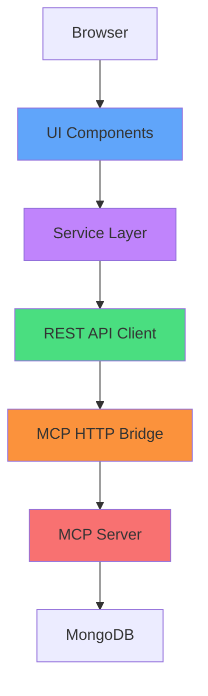
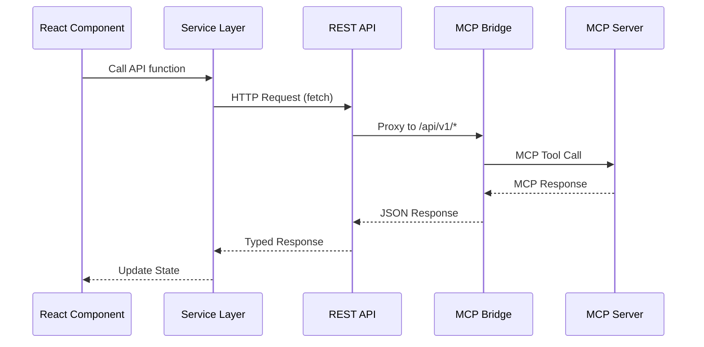
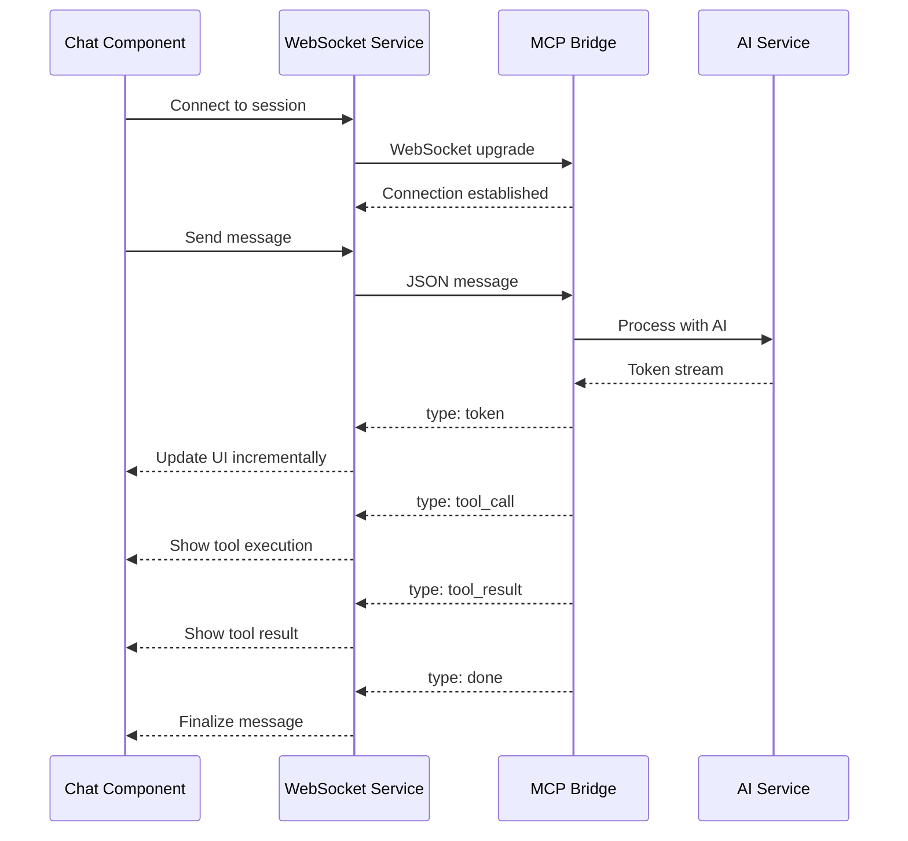
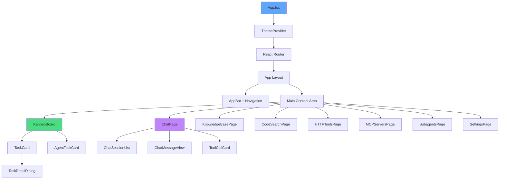
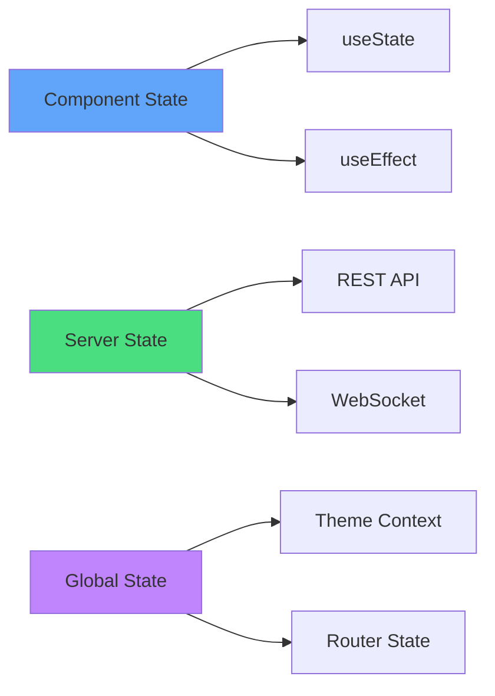
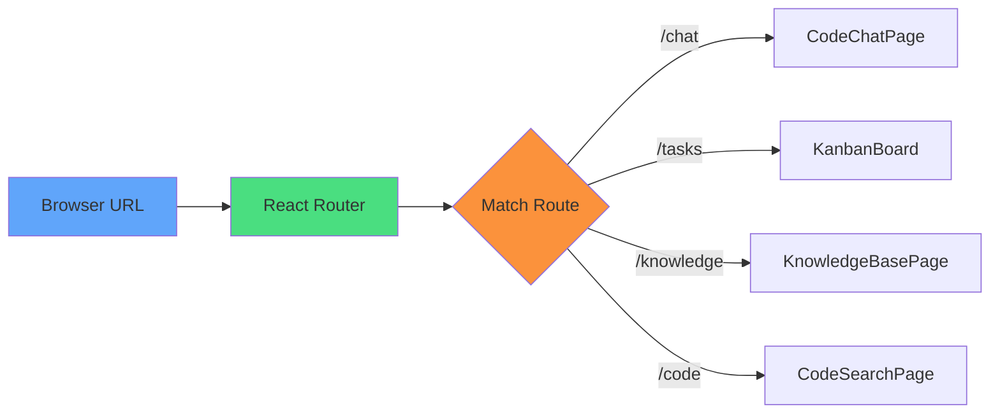
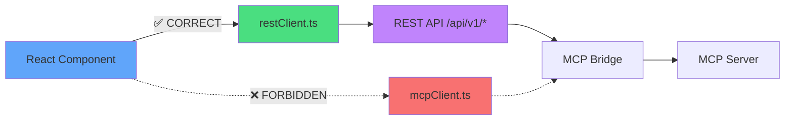
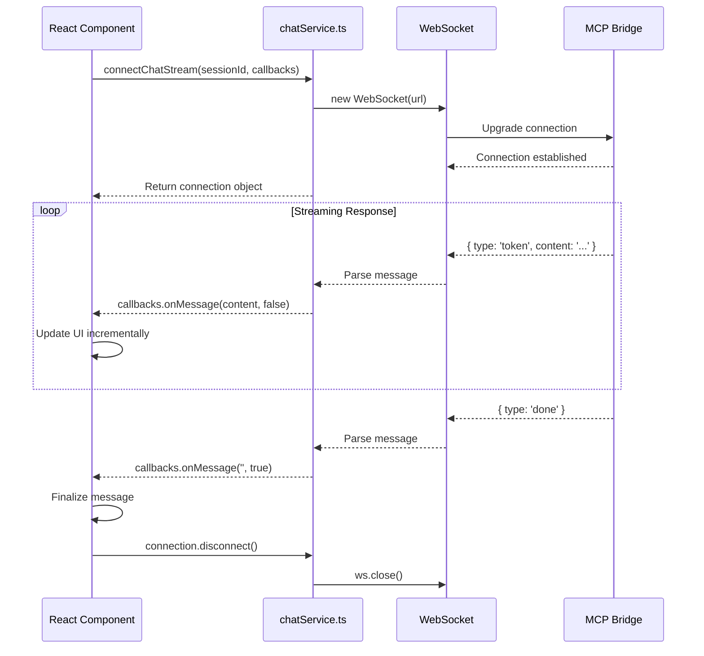
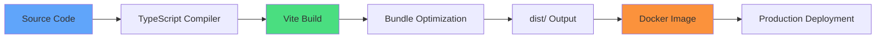

# Hyperion Coordinator UI - Architecture Documentation

## Table of Contents

1. [System Overview](#system-overview)
2. [Technology Stack](#technology-stack)
3. [Architecture Layers](#architecture-layers)
4. [Data Flow](#data-flow)
5. [Component Hierarchy](#component-hierarchy)
6. [State Management](#state-management)
7. [Routing Architecture](#routing-architecture)
8. [API Communication](#api-communication)
9. [WebSocket Integration](#websocket-integration)
10. [Build & Deployment](#build--deployment)
11. [Security Considerations](#security-considerations)

---

## System Overview

**Hyperion Coordinator UI** (ui2) is a modern React-based web application for managing AI development workflows, tasks, knowledge bases, and real-time chat interactions. The UI is designed with a mobile-first responsive approach and follows enterprise-grade architectural patterns.

### Key Characteristics

- **Zero Direct MCP Calls**: UI communicates exclusively through REST API layer
- **Real-time Updates**: WebSocket integration for chat and live data
- **Mobile-First Design**: Responsive layouts from 375px to 1920px
- **Accessibility Compliant**: WCAG 2.1 AA standards
- **Dark Mode Support**: System and manual theme switching
- **Type-Safe**: Full TypeScript coverage

---

## Technology Stack

### Core Framework

```
React 19.1.1
├── TypeScript 5.8.3
├── Vite 7.1.7 (Build Tool)
└── React Router 7.9.4 (Navigation)
```

### UI Libraries

```
Material-UI (MUI) 7.3.2
├── @emotion/react 11.14.0
├── @emotion/styled 11.14.1
├── @mui/icons-material 7.3.2
└── Tailwind CSS 4.1.13
```

### Features & Utilities

```
@hello-pangea/dnd 18.0.1 (Drag-and-drop)
react-markdown 10.1.0 (Markdown rendering)
react-syntax-highlighter 15.6.6 (Code highlighting)
ansi_up 6.0.2 (ANSI terminal colors)
```

### Testing

```
Playwright 1.55.1 (E2E Testing)
├── @axe-core/playwright 4.10.2 (Accessibility)
├── Vitest 3.2.4 (Unit Testing)
└── @testing-library/react 16.3.0
```

---

## Architecture Layers

The application follows a clean layered architecture with strict separation of concerns:



### Layer Responsibilities

| Layer | Description | Location |
|-------|-------------|----------|
| **UI Components** | React components, pages, routing | `src/components/`, `src/pages/` |
| **Service Layer** | Business logic, API clients | `src/services/` |
| **Type Definitions** | TypeScript interfaces | `src/types/` |
| **Theme & Styling** | MUI theme, Tailwind config | `src/theme.ts`, `tailwind.config.js` |
| **Build Configuration** | Vite, TypeScript, ESLint | `vite.config.ts`, `tsconfig.json` |

---

## Data Flow

### Request Flow (REST API)



### WebSocket Flow (Real-Time Chat)



---

## Component Hierarchy

### Application Structure



### Component Categories

#### **Pages** (`src/pages/`)
- `CodeChatPage.tsx` - Real-time AI chat interface
- `KnowledgeBasePage.tsx` - Knowledge base browser
- `CodeSearchPage.tsx` - Semantic code search
- `HTTPToolsPage.tsx` - HTTP tools testing
- `MCPServersPage.tsx` - MCP server registry
- `SubagentsPage.tsx` - Sub-agent management
- `SettingsPage.tsx` - Application settings

#### **Feature Components** (`src/components/`)
- `KanbanBoard.tsx` - Drag-and-drop task board (47 components total)
- `ChatMessageView.tsx` - Chat message rendering
- `ToolCallCard.tsx` - Tool execution display
- `AgentTaskCard.tsx` - Agent task display
- `TaskDetailDialog.tsx` - Task detail modal

#### **Code Components** (`src/components/code/`)
- `CodeSearch.tsx` - Code search interface
- `CodeResults.tsx` - Search results display
- `IndexStatus.tsx` - Indexing status
- `CodeIndexConfig.tsx` - Index configuration

---

## State Management

### State Architecture



### State Categories

#### 1. **Component-Local State** (useState, useReducer)

Used for:
- UI state (modals, dropdowns, selections)
- Form inputs and validation
- Temporary data transformations

```typescript
// Example: Modal state
const [isOpen, setIsOpen] = useState(false);
const [formData, setFormData] = useState({ title: '', description: '' });
```

#### 2. **Server State** (API Calls)

Managed through service layer with automatic refetching:

```typescript
// Example: Fetching tasks
const [tasks, setTasks] = useState<HumanTask[]>([]);
const [loading, setLoading] = useState(true);
const [error, setError] = useState<Error | null>(null);

useEffect(() => {
  restClient.listHumanTasks()
    .then(setTasks)
    .catch(setError)
    .finally(() => setLoading(false));
}, []);
```

#### 3. **WebSocket State** (Real-Time)

Managed through WebSocket service:

```typescript
// Example: Chat streaming
useEffect(() => {
  const connection = connectChatStream(sessionId, {
    onMessage: (content, done) => {
      setMessages(prev => [...prev, { content, done }]);
    },
    onToolCall: (tool, args, id) => {
      setToolCalls(prev => [...prev, { tool, args, id }]);
    },
    onError: (error) => {
      setError(error);
    }
  });

  return () => connection.disconnect();
}, [sessionId]);
```

#### 4. **Global Context** (Theme, Router)

Theme switching and routing state:

```typescript
// Theme context
const [themeMode, setThemeMode] = useState<'light' | 'dark'>('light');

// Router state
const location = useLocation();
const navigate = useNavigate();
```

---

## Routing Architecture

### Route Structure

```
/ (root)
├── /chat         → CodeChatPage (default)
├── /tasks        → KanbanBoard
├── /knowledge    → KnowledgeBasePage
├── /code         → CodeSearchPage
├── /tools        → HTTPToolsPage
├── /mcp-servers  → MCPServersPage
├── /subagents    → SubagentsPage
└── /settings     → SettingsPage
```

### Navigation Flow



### Route Configuration

Routes are defined in `App.tsx` using React Router v7:

```typescript
<Routes>
  <Route path="/" element={<Navigate to="/chat" replace />} />
  <Route path="/chat" element={<CodeChatPage key={refreshKey} />} />
  <Route path="/tasks" element={<KanbanBoard key={refreshKey} />} />
  {/* ... other routes */}
</Routes>
```

**Key Features:**
- Default redirect to `/chat`
- Refresh key support for force remounting
- Lazy loading ready for code splitting

---

## API Communication

### REST API Client Architecture

**⚠️ CRITICAL RULE: NO DIRECT MCP CALLS**



### API Service Modules

| Service | File | Purpose |
|---------|------|---------|
| **REST Client** | `restClient.ts` | Main API client for tasks, knowledge |
| **Chat Service** | `chatService.ts` | WebSocket + REST for chat |
| **Knowledge Service** | `knowledgeService.ts` | Knowledge base operations |
| **MCP Server Service** | `mcpServerService.ts` | MCP server registry |
| **Code Client** | `restCodeClient.ts` | Code search and indexing |
| **HTTP Tools Service** | `httpToolsService.ts` | HTTP tool operations |
| **AI Service** | `aiService.ts` | AI configuration and settings |

### API Client Pattern

All API clients follow this pattern:

```typescript
class RestClient {
  private async fetchJSON<T>(
    endpoint: string,
    options?: RequestInit
  ): Promise<T> {
    const response = await fetch(`${BASE_URL}${endpoint}`, {
      ...options,
      headers: {
        'Content-Type': 'application/json',
        ...options?.headers,
      },
    });

    if (!response.ok) {
      throw new Error(`API Error: ${response.status}`);
    }

    return await response.json();
  }

  async listHumanTasks(): Promise<HumanTask[]> {
    const data = await this.fetchJSON<{ tasks: APIHumanTask[] }>('/tasks');
    return data.tasks.map(transformHumanTask);
  }
}
```

### ESLint Enforcement

The architecture is enforced by ESLint rules:

```javascript
{
  'no-restricted-imports': [
    'error',
    {
      patterns: [
        {
          group: ['**/services/mcpClient'],
          message: 'Direct MCP calls are prohibited. Use restClient instead.'
        }
      ]
    }
  ]
}
```

---

## WebSocket Integration

### WebSocket Architecture



### WebSocket Message Types

| Type | Description | Payload |
|------|-------------|---------|
| `token` | Streaming text token | `{ content: string }` |
| `tool_call` | Tool execution started | `{ toolCall: { tool, args, id } }` |
| `tool_result` | Tool execution completed | `{ toolResult: { id, result, error, durationMs } }` |
| `done` | Stream completed | `{}` |
| `error` | Error occurred | `{ error: string }` |

### WebSocket Connection Example

```typescript
import { connectChatStream } from '@/services/chatService';

const connection = connectChatStream(sessionId, {
  onMessage: (content, done) => {
    if (done) {
      console.log('Stream complete');
    } else {
      appendToMessage(content);
    }
  },
  onToolCall: (tool, args, id) => {
    showToolExecution({ tool, args, id });
  },
  onToolResult: (id, tool, result, error, durationMs) => {
    showToolResult({ id, tool, result, error, durationMs });
  },
  onError: (error) => {
    showError(error);
  }
});

// Clean up on unmount
return () => connection.disconnect();
```

---

## Build & Deployment

### Build Configuration

**Vite Configuration** (`vite.config.ts`):

```typescript
export default defineConfig({
  plugins: [react()],
  base: '/ui/',  // Always served through Go proxy at /ui/ route
  server: {
    proxy: {
      '/api/v1': {
        target: process.env.VITE_MCP_BRIDGE_URL || 'http://localhost:7095',
        changeOrigin: true
      },
      '/api/mcp': {
        target: process.env.VITE_MCP_BRIDGE_URL || 'http://localhost:7095',
        changeOrigin: true
      }
    }
  }
})
```

### Build Process



### Environment Variables

| Variable | Default | Description |
|----------|---------|-------------|
| `VITE_MCP_BRIDGE_URL` | `http://localhost:7095` | MCP Bridge API endpoint |

### Deployment Targets

1. **Development**: `npm run dev` (Vite dev server on port 5173)
2. **Production**: `npm run build` → `dist/` → Docker image
3. **Testing**: `npm test` (Playwright E2E tests)

---

## Security Considerations

### Architecture-Level Security

1. **No Direct MCP Access**: Enforced by ESLint, prevents direct MCP tool calls
2. **Type Safety**: Full TypeScript coverage prevents runtime type errors
3. **Input Validation**: All API inputs validated before sending
4. **CORS Protection**: API proxy handles CORS correctly
5. **XSS Prevention**: React auto-escapes content, `dangerouslySetInnerHTML` avoided

### API Security

```typescript
// All API requests go through typed client
const client = new RestClient();

// Type-safe request
const tasks: HumanTask[] = await client.listHumanTasks();

// Error handling
try {
  await client.updateTaskStatus(taskId, 'completed');
} catch (error) {
  // Typed error handling
  console.error('Update failed:', error.message);
}
```

### WebSocket Security

- WebSocket connections authenticated via session ID
- Messages validated on server before processing
- Automatic reconnection with exponential backoff
- Error boundaries prevent cascading failures

---

## Related Documentation

- [Component Catalog](./COMPONENTS.md) - Complete component reference
- [API Integration Guide](./API_INTEGRATION.md) - Service layer details
- [Developer Guide](./DEVELOPER_GUIDE.md) - Getting started
- [Testing Guide](./TESTING.md) - Test suite documentation
- [UI/UX Patterns](./UI_UX_PATTERNS.md) - Design system
- [Troubleshooting](./TROUBLESHOOTING.md) - Common issues

---

**Last Updated**: 2025-11-04
**Version**: ui2 (Hyperion Coordinator UI)
**Maintainer**: Hyperion Platform Team
